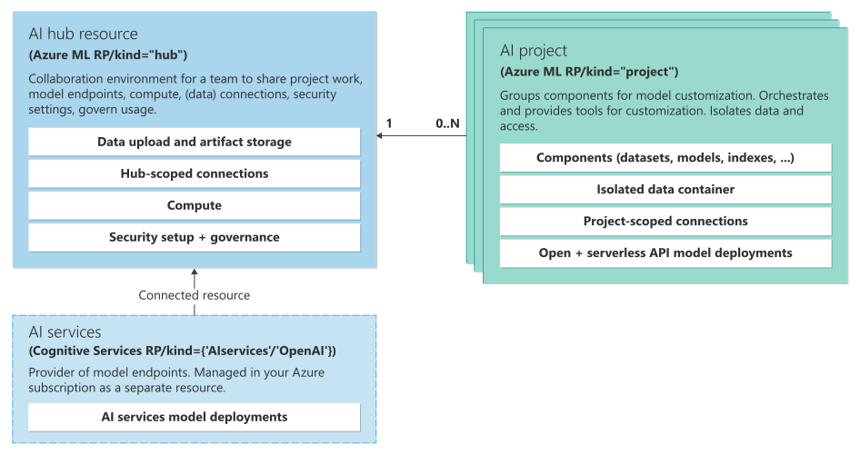

Understanding Identity and Access Management in Azure AI Foundry

Introduction

Identity and Access Management (IAM) in Azure AI Foundry ensures that the right people and services have appropriate access to your AI environment. Azure AI Foundry builds on Azure’s Role-Based Access Control (RBAC) model to manage who can view, create, or modify resources in a Foundry hub or project. In this blog post, we explain how IAM is structured and functions within Azure AI Foundry, covering key concepts like RBAC roles, identity types, access scopes (hub, project, and asset levels), role assignment and evaluation, and security best practices for managing access. The goal is to give developers, data scientists, and IT administrators a clear, technical understanding of Azure AI Foundry’s IAM model so you can effectively secure your AI projects.

Role-Based Access Control (RBAC) Overview in Azure AI Foundry

Azure AI Foundry uses Azure RBAC as its authorization system. This means every action (such as creating a project or deploying a model) is controlled by roles defined in Azure and assigned to identities. Roles in Azure RBAC are collections of permissions (allowed actions) that can be granted to users or other security principals. When you use Azure AI Foundry, you leverage the same Azure-wide RBAC system to control access. Users in your Microsoft Entra ID (Azure AD) tenant are assigned specific roles that grant them permissions on Azure AI Foundry resources . Azure provides a set of built-in roles for common Foundry use cases, and you can also create custom roles if the built-ins don’t fit your needs .

Under the hood, when a user tries to perform an action in Azure AI Foundry (for example, creating a new compute instance or modifying a project), Azure checks whether that user’s assigned roles include a permission that allows the action. The Foundry portal is smart enough to reflect these permissions in the UI: if your role doesn’t permit an action, the option may be hidden or disabled in the interface. For example, if a role does not include permission to create compute instances, the portal will not show the Create Compute button for that user . This prevents users from attempting operations they are not authorized to do and aligns the user experience with their access level (avoiding frustrating “access denied” errors by simply not offering disallowed actions). In summary, RBAC ensures a consistent enforcement of access rules across Azure AI Foundry, using Azure’s proven IAM framework.

Identity Types in Azure AI Foundry IAM

In Azure AI Foundry, who can be granted access is defined by Azure RBAC’s supported identity types. Azure RBAC allows you to assign roles to various kinds of security principals: users, groups, service principals (applications), and managed identities .
	•	User Accounts: These are individual people in your organization (developers, data scientists, IT admins) with Microsoft Entra ID accounts. You can assign roles to user accounts directly to grant them access to Foundry hubs or projects. For example, you might give a data scientist the Contributor role on a project so they can run experiments in that project.
	•	Groups: Azure AD groups can have roles assigned to them. This is useful for managing access at scale – for instance, you could create a group for your Data Science team and assign that group a role on a project, thereby granting all members of the group the same access. Using groups simplifies administration because you can add or remove users from the group to change access, rather than updating role assignments one by one.
	•	Service Principals (App Registrations): Service principals represent applications or automation scripts. If you have a CI/CD pipeline or an external application that needs to interact with Azure AI Foundry (for example, to deploy a model automatically), you’d register an Azure AD application and use its service principal. You can then assign roles to that service principal just like a user. This allows the application to call Azure AI Foundry APIs or resources with the permissions of the role. It’s a best practice to use service principals for automation instead of user accounts, so you can tightly control and monitor what the app can do.
	•	Managed Identities: Azure AI Foundry itself uses a system-assigned managed identity for certain operations. When you create a Foundry hub, it comes with a managed identity that the service uses to provision and access Azure resources on your behalf. This managed identity is automatically assigned a special role (the Azure AI Administrator role, currently in preview) which grants it the minimal permissions it needs to do its job . You can also use user-assigned managed identities in scenarios where you want a standalone identity with specific roles attached. In short, managed identities are identities managed by Azure for services, and they can be granted RBAC roles just like users or service principals – in fact, they are a type of service principal under the hood.

All these identity types are integrated via Microsoft Entra ID for authentication, and authorization in Azure AI Foundry is then governed by RBAC role assignments to these identities. This flexible model means you can secure your AI Foundry environment whether access is by a person or an automated process, using the same set of role definitions.

Access Control Scopes: Hubs, Projects, and Assets

Azure AI Foundry introduces a hierarchy of scopes for organizing resources and applying access control. The two primary levels are the hub and the project, and within projects you have various assets (such as datasets, models, compute instances, connections, etc.). Understanding these scopes is key to structuring your IAM strategy:
	•	Hub Level (Foundry Hub): The hub is the top-level container in Azure AI Foundry. It represents the overall AI environment or workspace collection. The hub is where you configure foundational infrastructure and settings: for example, virtual network integration, customer-managed encryption keys, managed identities, and linked Azure AI services are configured at the hub level . Having access at the hub level typically means you can perform high-impact tasks like modifying infrastructure settings, creating new projects under that hub, or even creating additional hubs (depending on your role permissions). In essence, the hub is the administrative scope for your Azure AI Foundry deployment.
	•	Project Level (Foundry Project): A project in Azure AI Foundry is a subdivision of a hub intended for specific AI solutions or teams. Projects act as isolated workspaces within the hub . Within a project, you can build and deploy AI systems – for example, you might have a project for a particular machine learning workflow or application. You can create and manage project assets such as data flows, model deployments, compute targets, and so on inside the project . Project access allows you to do end-to-end development and deployment of AI solutions, but it does not necessarily grant rights to alter the underlying hub infrastructure. In other words, a user with only project-level access can work on their AI tasks in that project, but cannot create new projects or modify settings that affect the entire hub.
	•	Asset Level: Within projects, you have individual resources and assets (for example, a specific dataset, a compute instance, a machine learning model, a connection to an external service, etc.). Azure RBAC can, in general, be applied at the level of an individual Azure resource. In practice, however, Azure AI Foundry’s default permission model is managed mostly at the project and hub levels for simplicity. Typically, if a user has contributor access to a project, they can create and manage all assets in that project (there isn’t a need to assign a separate role for each dataset or model in the project). That said, you could use Azure RBAC to set granular permissions on specific underlying resources if needed. For example, you might have a sensitive data asset for which you restrict access – this could be achieved by Azure RBAC on the storage account or Key Vault that backs that asset. Most of the time, though, project-level roles suffice for asset management. Azure AI Foundry ensures that project-level permissions cascade to the assets within the project, making it easier to manage permissions. A developer with the appropriate project role can build and deploy AI models in that project and create the necessary assets like computes and connections without needing separate grants for each .

Hub-Project Relationship and Inheritance: The relationship between hubs and projects also involves inheritance of security settings. One key benefit of Azure AI Foundry’s hub/project design is that when you create a new project, it automatically inherits the hub’s security configurations . For example, if certain policies or permissions are set at the hub, those can flow down to projects. Additionally, when a user is added to a project, Azure AI Foundry will automatically grant them some access at the hub level (read access by default) to ensure a smooth experience. Specifically, when you invite or assign a user to a project, two background role assignments happen: that user gets a Reader role on the hub and an Azure AI Inference Deployment Operator role on the underlying resource group for deployments . The Reader role on the hub lets them view hub-level information (since working in a project often involves referencing things about the hub), and the Inference Deployment Operator role gives them permission to create deployments in Azure (allowing their model deployments or other resources to actually be provisioned in the Azure resource group) . Together, these automatically assigned roles, plus the explicit project role you gave the user, enable the user to do end-to-end AI development and deployments within that project .

Finally, it’s important to note that Azure RBAC scopes are hierarchical. Roles assigned at a higher scope also apply to lower scopes. In Azure AI Foundry terms, the hub is a higher scope containing projects (which are resources in the hub’s resource group). If you assign someone a role at the hub level, those permissions can apply to all projects under that hub (depending on the permission). Conversely, a role at the project level won’t grant access outside that project or to the hub’s management functions. Azure’s RBAC also extends above the hub: you could assign roles at the resource group or subscription level that trickle down to all Azure AI Foundry resources in that container. For example, an Azure subscription administrator might already have broad roles that cover all resources, including the Foundry hub. However, it’s usually best practice to scope role assignments as narrowly as possible – which in Foundry means using the hub or project scopes appropriately rather than overly broad scopes.

Built-in RBAC Roles in Azure AI Foundry

Azure AI Foundry comes with a set of built-in Azure roles designed specifically for common roles within a hub or project. These roles encapsulate typical permission sets needed by different personas (from administrators to developers to read-only viewers). There are distinct built-in roles at the hub level and at the project level (they often have the same names but apply at different scopes with slightly different implications). Below we outline the key built-in roles for both hubs and projects and what they allow:

Hub-Level Roles

These roles are assigned on the Azure AI Foundry hub (which is an Azure resource, akin to an Azure Machine Learning workspace underlying the hood). Hub roles govern what a user can do in the context of that entire hub (including all its projects):
	•	Owner (Hub): Full administrative access to the hub. Owners can do anything within the hub, including creating new projects, managing all resources, and assigning access roles to other users on that hub . In fact, when a hub is created, the creator is automatically granted the Owner role for that hub . Hub Owners can add or remove users in any role for the hub or its projects. This is the highest privilege level, so it should be limited to trusted administrators.
	•	Contributor (Hub): Nearly full access to the hub, with one important caveat: a Contributor cannot manage access permissions on that hub . In other words, Contributors can create and modify resources (they can even create new hubs under the same Azure subscription, and create projects in the hub), but they cannot assign roles to others or change who has access. This is useful for power users who need control over resources but should not manage security. A hub Contributor can perform all hub operations except altering IAM on the hub itself.
	•	Azure AI Administrator (Hub, Preview): A special built-in role intended for the hub’s managed identity and other automated scenarios . This role has a very narrow set of permissions – essentially the minimum privileges required for Azure AI Foundry’s own infrastructure components to function. When you create a new hub, its system-assigned managed identity is automatically given the Azure AI Administrator role on that hub (and related resource group) instead of a broader role . This follows the principle of least privilege, ensuring the platform’s service identity only has what it absolutely needs. (Earlier, before this role existed, the managed identity might have been a Contributor on the resource group, which was more access than needed.) Note that as of this writing, the Azure AI Administrator role is in public preview, meaning it’s not yet generally recommended for production use . Microsoft recommends updating older hubs to use this role for the managed identity to tighten security , but be cautious and test since preview features come without a full SLA. Typically, you won’t assign this role to human users – it’s meant for service identities.
	•	Azure AI Developer (Hub): The Azure AI Developer role is designed for users who need to build and deploy AI solutions within an existing hub, but who should not create or manage hubs themselves  . A user with the Azure AI Developer role on a hub can do almost everything needed for AI development: they can create new projects in that hub, use or create compute resources, set up data connections, deploy models, and generally interact with Azure AI services that are connected to the hub . However, they cannot create a new hub (only use the current one) and they cannot change hub-level access permissions . This role is very useful in larger organizations – for example, you might give a team lead the Azure AI Developer role on a central hub so they can spin up projects for their team, without granting them full hub ownership rights. The Azure AI Developer role strikes a balance by allowing project creation (and everything inside the hub), but not allowing the creation of additional hubs or altering of who has access at the hub level . (In effect, it’s similar to Contributor but with the “create new hub” capability removed for safety.) If you want to prevent proliferation of hubs or control costs/quota, use Azure AI Developer instead of Contributor for most power users on the hub.
	•	Azure AI Inference Deployment Operator (Hub): This role has a very specific scope: it allows the user to perform all actions required to create a resource deployment in an Azure resource group . In the context of Azure AI Foundry, this means the user can deploy inference endpoints or other Azure resources (like creating an Azure Machine Learning inference endpoint, or triggering Azure resource deployments necessary for AI services). This role is typically not assigned to users manually in day-to-day management; instead, it’s often auto-assigned in the background when needed. For instance, as mentioned earlier, when a user is given access to a project, Foundry automatically grants them the Inference Deployment Operator role on the resource group so that they can deploy models from that project . You might also assign this role explicitly if you had a scenario where a user should be allowed to deploy things but have no other permissions. It’s a limited scope role, useful for enabling deployments without over-provisioning access.
	•	Reader (Hub): Read-only access to the hub and its settings . A user with the Reader role can view resources and configurations but cannot make any changes. By default, all project members of a hub are automatically granted Reader access to the hub  (this is done so that if you invite someone to a project, they can at least read information about the hub that the project belongs to). The Reader role is ideal for stakeholders or auditors who need to inspect or monitor the hub and projects without modifying anything. It can also be a supplementary role – for example, someone might be a Reader on the hub but an active Contributor on a specific project, allowing them to see high-level hub info while having edit rights only in their project.

Project-Level Roles

Project roles apply to individual projects within a hub. These roles govern what a user can do inside that specific project (and do not grant rights outside the project). Project roles mirror the structure of hub roles, with similar privileges scoped to the project level:
	•	Owner (Project): Full control of a project. A Project Owner can do anything in the project – from creating or deleting resources (experiments, models, etc.) to deploying services – and crucially, they can manage access for that project by assigning roles to other users on the project . So, if a data science project is collaborative, one person (or a few) would be made Project Owners to administer the project and invite or remove team members. Project Owners cannot change settings at the hub level, but they don’t need to – their focus is the project. Typically, the person who creates a project becomes its Owner by default, although hub admins can also assign additional project owners.
	•	Contributor (Project): Broad permissions to create and modify everything in the project, except they cannot grant or revoke access to the project (no role assignment capability) . Project Contributors can run experiments, upload data, create pipelines, deploy models, etc., within that project. This role is for the core team members who actively develop AI solutions in the project. The only thing they lack compared to an Owner is the ability to manage other users’ access. For example, a data scientist might be a Contributor on the project – they can do all the work they need, but if a new colleague needs access, they would ask a Project Owner to add that person rather than doing it themselves.
	•	Azure AI Administrator (Project, Preview): This is the same Azure AI Administrator role mentioned in the hub roles, but listed here to indicate that the hub’s managed identity will also appear with this role in each project (because the managed identity’s permissions span the hub’s resource group, which includes projects) . Essentially, it’s not a role you’d assign to a user for a project; it’s the service identity’s role carried into the project scope. The Azure AI Administrator role at project level has the minimal needed permissions for the service to manage project-level resources. As with the hub, it’s a preview role and primarily for internal use by the platform, ensuring the service (via its managed identity) can, for example, provision compute or link services in the project, without having excess permissions .
	•	Azure AI Developer (Project): Allows a user to perform most actions in the project (e.g., create and run experiments, create deployments) but does not allow managing project access (similar to Contributor in that sense) . The Azure AI Developer role at the project level is very similar to the Contributor role; it’s possible that in the project context the differences between Contributor and Developer are minimal (both cannot assign roles). The naming is more relevant at the hub scope. However, having an Azure AI Developer role at project level could be useful if you want to indicate a user’s focus on deployment tasks. In practice, whether you use Contributor or Azure AI Developer on a project might depend on organizational preference since both give broad permissions in the project. (Both roles allow creating deployments, but Azure AI Developer might be a better fit if you conceptually separate “developers” from “contributors” in your process.)
	•	Azure AI Inference Deployment Operator (Project): Similar to the hub description, at the project level this role would allow the user to create deployments (e.g., deploy an AI model as an endpoint) in the context of that project’s resource group . If someone only had this role on a project, they could deploy or update inference endpoints, but they couldn’t do much else in the project. Typically, you won’t manually give a user just this role on a project – it’s usually auto-granted as part of project membership to supplement other roles. For instance, if a user somehow only needs to deploy models that others have prepared, this role could be part of a custom minimal role assignment for them. Generally, project Contributors or Developers already have the ability to deploy, so you’d rarely assign this in isolation.
	•	Reader (Project): Read-only access to all project content . A Project Reader can view experiments, models, logs, etc., but cannot make any changes. This is useful for supervisors, clients, or any stakeholder who should be informed about the project’s progress or configurations but shouldn’t mess with the environment. You might also assign Reader to someone who is transitioning roles or for audit purposes. By default, adding someone to a project in a higher role doesn’t automatically give them Reader on that project (it’s the other way around – project membership gives Reader on hub). So Reader is a distinct role if you explicitly want someone to only observe the project.

It’s worth noting that when you add a user to a project via the Azure AI Foundry portal’s permission management, the platform will handle some cross-assignment for you. As mentioned earlier, adding a person to a project will automatically make them a Reader on the hub (so they can see hub info) and an Inference Deployment Operator on the resource group (so they can deploy resources from the project) . This means that typically, to enable a user for end-to-end work in a project, you just give them either the Project Contributor or Project Azure AI Developer role (for edit access) – the system ensures they inherit the other necessary permissions to function . The minimum permission a user needs to create a new project in a hub is having a role on the hub that includes the action Microsoft.MachineLearningServices/workspaces/hubs/join . The built-in Azure AI Developer role (at the hub) includes this, which is why a hub-level Azure AI Developer can create projects. If a user only has, say, Reader on a hub, they would not be able to create a project in that hub because they lack that “join hub” permission.

Role Assignment and Permission Evaluation

Understanding how roles are assigned and evaluated in Azure AI Foundry will help you manage access effectively and troubleshoot permission issues. Azure RBAC’s evaluation logic is the same for Foundry as it is for any Azure resource: a user’s effective permissions are the sum of all roles assigned to them (directly or via group membership) at the resource scope in question, including any inherited roles from parent scopes. Let’s break down what this means in practice for Azure AI Foundry:
	•	Assigning Roles: Roles can be assigned through multiple interfaces. For Azure AI Foundry specifically, if you are a Hub Owner, you can manage access directly in the Foundry portal UI – go to your hub’s Users section and add or remove users and set their roles . This provides a convenient, context-specific way to invite team members to the hub or projects. Under the covers, this is creating Azure role assignments on the appropriate Azure resource (the hub or the project) for that user. You can also use the standard Azure tools to manage roles: for example, via the Azure Portal by navigating to the hub resource and using the Access Control (IAM) blade, or by using Azure CLI/PowerShell. The Azure CLI command az role assignment create can be used to script role assignments. For instance, the following command assigns the “Azure AI Developer” role to a user at a resource group (hub) level:

az role assignment create --role "Azure AI Developer" --assignee user@example.com --resource-group YourHubResourceGroup

. This flexibility means your organization can integrate Foundry access management into existing Azure governance processes. For example, an IT admin might prefer using an Infrastructure-as-Code tool or Azure CLI scripts to set up initial access for all team members when a hub is created.

	•	Scope of Assignments: When assigning a role, you must specify the scope at which it’s being applied – e.g., subscription, resource group, or a specific resource (like a hub or project). The scope determines where the permissions take effect. Azure AI Foundry’s resources (hubs and projects) live within a resource group in your Azure subscription. If you assign a role on the hub (which is an Azure Machine Learning workspace resource in the resource group), that role can apply to the hub and, by inheritance, to all projects under that hub (projects are actually implemented as part of the workspace’s hierarchy). If you assign a role on a particular project (which might be a child resource within the workspace), it applies only to that project. If you assign a role at the resource group level that contains the hub, it could apply to the hub and everything in it (essentially all projects as well) . Be mindful of scope: granting broad scopes (like an entire subscription or resource group) gives wide-reaching access. In contrast, a narrow scope (a single project) limits the impact of that role to just that project.
	•	Inheritance and Evaluation: Azure evaluates a user’s permissions by looking at all role assignments that apply to the resource in question. For example, say a user is trying to deploy a model in Project A. Azure will check: do they have a role on Project A that allows this action? Do they have a role on the parent hub that allows this action (inherited down to Project A)? Do they have any role at the resource group or subscription level that allows the action (inherited further down)? If any of those role assignments grant the required permission, the action is allowed. This means a higher-level assignment can confer privileges to lower-level resources. For instance, if John is made a Contributor on the hub, he automatically can do contributor actions in all projects of that hub – even if he isn’t individually listed on each project, his hub-level role gives him effective rights within them. On the other hand, if Jane is a Contributor on Project A only, she has no rights in Project B, and only read rights on the hub (since project membership gave her a hub Reader role). Her permissions are confined to Project A. The most powerful permission wins in Azure RBAC – roles are additive (there are no negative permissions unless explicitly implemented via deny assignments, which are advanced and not common). So if you accidentally give someone more access at a higher scope, that will override the limitations you set at a lower scope. Always double-check that users don’t inadvertently have broad roles that grant more than intended.
	•	Multiple Role Assignments: It’s possible for a user to have multiple roles overlapping. Perhaps someone is part of a group that is a Reader on the hub, but individually they are assigned as a Contributor on a project. In that case, effectively they can read everything on the hub, and they can fully contribute in that one project. The Reader role doesn’t hinder their Contributor capabilities – it just adds read access in places they might not otherwise have access. If a conflict ever seems to arise (e.g., a user has two roles with different levels of access on the same resource), remember that Azure RBAC does not really subtract permissions; it unions them. The user will have the superset of permissions. The only nuance is if two roles target different scopes, their influence is limited to those scopes. In summary, permissions accumulate.
	•	Role Evaluation in the Portal: We mentioned earlier that the Azure AI Foundry portal UI will adapt based on your roles. Internally, this is also an evaluation of your effective permissions. If you notice that certain buttons or features are missing for a user, it usually indicates their role doesn’t permit that action. For example, a user with only the Reader role will see everything in view-only mode; none of the create/edit buttons will be active for them. A user with an Azure AI Developer role on the hub will see options to create new projects, whereas a project-level Contributor will not see an option to create a new project (since that’s outside their scope). These cues can help diagnose permission issues quickly. For more detailed checks, Azure provides tools (like the az role assignment list CLI command or the Access Control (IAM) UI) to list all roles a user has at various scopes, and the “Check access” feature in the Azure Portal can simulate whether a given user has a certain permission on a resource.
	•	Automatic Role Assignments for Project Members: As described, Azure AI Foundry will auto-assign some roles to users when you add them to a project (hub Reader and deployment operator). These are evaluated just like any other assignments. If you ever remove a user from a project, those auto-assignments are removed, and they would lose the associated hub read or deployment privileges too. It’s useful to know this happens so you’re not confused by seeing extra role assignments when looking at IAM in the Azure Portal – they exist to make the project work seamlessly.
	•	Custom Roles and Advanced Scenarios: If the built-in roles don’t cover a specific scenario, Azure AI Foundry allows the use of custom roles. Creating a custom role involves defining your own set of allowed operations. For example, you might create a custom role that only permits running experiments but not creating deployments, if you had such a need. You can scope custom roles to a subscription, resource group, or even a single resource . To create or assign a custom role, you must have Owner access at that scope (e.g., to create a custom role at the resource group level, you need to be Owner of that resource group) . Once defined, a custom role acts like any other role in terms of assignment and evaluation. Use custom roles sparingly and only if necessary, as they add complexity – the built-in roles are tested and cover most common requirements.

Security Best Practices for Managing Access

Managing IAM in Azure AI Foundry requires not just understanding roles and identities, but also following good security practices to ensure your AI environment remains secure and well-governed. Here are some best practices and guidelines for managing access in Azure AI Foundry:
	•	Apply Least Privilege: Always give the minimum level of access needed for a user or service to perform their work . For example, if a user just needs to contribute to one project, assign them a role on that project only, rather than a hub-wide role. Avoid making everyone an Owner or Contributor at the hub unless they truly need that scope of control. Azure AI Foundry’s introduction of the Azure AI Administrator role for service identities is a good example of least privilege in action – it narrows the permissions of the managed identity to only what’s necessary . Regularly review roles and remove any unnecessary privileges from users who have changed roles or no longer need access.
	•	Limit High-Privilege Roles: Be cautious with the Owner role on hubs and projects. At the hub level, only a very small number of trusted administrators (e.g., an IT admin or platform ops person) should be Owners, since they can control everything including access assignments. For projects, you might also limit Owners to lead members of the project team. The Contributor and Azure AI Developer roles are powerful but slightly less sensitive since they can’t change access assignments – still, you should also limit those to users who genuinely need to create or modify resources extensively. A common enterprise pattern is: the IT admin is the Owner of the hub (ensuring overall governance), managers or lead engineers are given Contributor or Azure AI Developer on the hub (so they can manage resources but not alter who has hub access), and regular team members work at the project level  . This way, you have a hierarchy of control: central governance at the hub, delegated project management at the project level. Also consider requiring multiple owners (to avoid a single point of failure), but not too many (to maintain accountability).
	•	Control Hub Creation: Azure AI Foundry allows only certain roles to create new hubs – specifically, the built-in Owner and Contributor roles at the subscription/resource group level have this ability (and custom roles currently cannot grant it) . If you want to restrict the proliferation of hubs (which could incur costs or complicate management), assign users the Azure AI Developer role at the hub level instead of Contributor . As noted, Azure AI Developer has all needed permissions except creating hubs, so it’s a safer choice for most power users. Only give Contributor (or elevate to Owner) on the hub to those who should legitimately be creating new hubs. Some organizations might even choose to restrict hub creation to IT and require others to request it through a ticketing process. Managing who can create hubs helps enforce consistency and prevent untracked resource usage.
	•	Use Azure AD Groups for Access Management: Rather than assigning roles to many individual users, consider using Azure AD groups. For example, create a group for “Foundry Project Alpha Contributors” and assign that group the Contributor role on the project. This makes it easier to onboard/offboard people – an IT admin can just add a new hire to the appropriate group and they inherit the access. It also reduces the clutter in your role assignment list and helps ensure consistency (everyone in a group has the same permissions). Just be sure to manage group membership carefully and keep group lists up to date.
	•	Secure Service Principals and Automation: If you have service principals or managed identities that are used by applications or automation scripts (for CI/CD, scheduled retraining jobs, etc.), treat their access as you would a human user’s access. Assign them only the roles they absolutely need. For instance, if a GitHub Actions workflow uses a service principal to deploy a model to a project, that SP might only need the Project Contributor role on that project – it likely doesn’t need any hub-level role. Monitor the activity of these non-human identities through Azure AD sign-in logs and Azure activity logs to ensure they aren’t doing anything unexpected. Also rotate credentials or use certificate-based auth for service principals to reduce risk.
	•	Convert Legacy Roles to Least Privilege (if applicable): If your Azure AI Foundry hub was created before the Azure AI Administrator role existed (pre-Nov 19, 2024), its system-managed identity might currently have a Contributor role on the resource group. Microsoft recommends updating such hubs to use the more restrictive Azure AI Administrator role for that identity . You can perform this conversion via Azure REST API, CLI, or SDK as described in the documentation (essentially enabling a flag to use the new role)  . Doing so ensures the managed identity (which acts on behalf of the service) isn’t accidentally over-privileged. This is a one-time setup security improvement. If there are issues with the new role, Microsoft notes you can temporarily revert the managed identity to Contributor, but the long-term goal should be least privilege .
	•	Monitor and Audit Access: Azure provides tools to audit who has access to what. Periodically review the role assignments on your hub and projects. You can use Azure Portal’s IAM view or az role assignment list to enumerate assignments. Ensure that the list of Owners and Contributors is as expected. Remove users who no longer need access (for example, if someone leaves the team or the company, part of your offboarding should be to remove them from all Azure AI Foundry roles). Azure AI Foundry doesn’t yet have a specialized permission report, but since it relies on Azure RBAC, your standard Azure auditing practices apply. Additionally, consider enabling Azure AD Privileged Identity Management (PIM) if available, to make roles like Owner or Contributor eligible and time-bound, rather than permanently assigned, adding an extra layer of security for high-privilege roles.
	•	Manage External Resource Access: Often your AI projects will integrate with other Azure services (like Storage accounts, Azure OpenAI, Azure Cognitive Search, etc.). When those services are within the Foundry hub’s configured resources, the built-in roles cover access. But if you want to use a resource outside of what the hub created (for example, an existing Azure Storage account in your subscription or a new Cognitive Service resource), you need to ensure cross-access is configured . In practice, this means two things: (1) The user or managed identity trying to use that external resource must have permission on it, and (2) the hub (or its managed identity) may need permission on that resource as well. For example, if your project wants to read from a Blob Storage that wasn’t set up by the hub, you might assign the hub’s managed identity the “Storage Blob Data Reader” or a similar role on that storage account. Similarly, if connecting to an Azure AI Search service, you’d ensure the appropriate role assignment exists so Foundry (or your user) can access it . Always adhere to least privilege here too – grant only the needed level of access on external resources. By managing external resource IAM, you maintain a secure end-to-end pipeline where both the Azure AI Foundry and the integrated services honor access controls.
	•	Educate Team Members: Finally, make sure your team understands the roles they have and the responsibilities or limitations that come with them. Developers should know, for instance, that if they can’t create a project it might be because they aren’t given a hub-level role that allows it. Encourage a culture where people ask for the access they need and no more. This avoids privilege creep, where someone might request Owner access just because something didn’t work, when in fact a lesser role would have sufficed if configured properly. Clear documentation or an internal wiki for your organization’s use of Azure AI Foundry IAM can help newcomers quickly get up to speed on how to get access to the resources they need.

Conclusion

Azure AI Foundry’s IAM model is a powerful and flexible system built on Azure’s proven RBAC framework. By understanding the hierarchy of hubs and projects, the built-in roles available, and how role assignments work, you can confidently manage access to your AI projects. In summary, Role-Based Access Control in Azure AI Foundry lets you assign fine-grained permissions to users or service identities – whether at the broad hub level or the granular project level – ensuring each person or service has the right level of access and nothing more. Identities such as users, groups, and service principals from Microsoft Entra ID form the basis of these assignments, integrating seamlessly with your enterprise directory  . As you implement Azure AI Foundry in your organization, take advantage of the built-in roles (Owner, Contributor, Azure AI Developer, etc.) to quickly set up common access patterns, and remember that you can extend or restrict via custom roles if needed. Always keep security best practices in mind: use least privilege, limit who can make large-scale changes, and regularly audit access. By doing so, you’ll create a robust, secure environment where developers and data scientists can innovate with AI confidently, and administrators can sleep easier knowing the right safeguards are in place. Azure AI Foundry’s IAM, when used wisely, ensures your AI initiatives are not only powerful and collaborative but also securely governed.

Sources: Role-based access control in Azure AI Foundry (Microsoft Learn)      and Azure RBAC documentation .